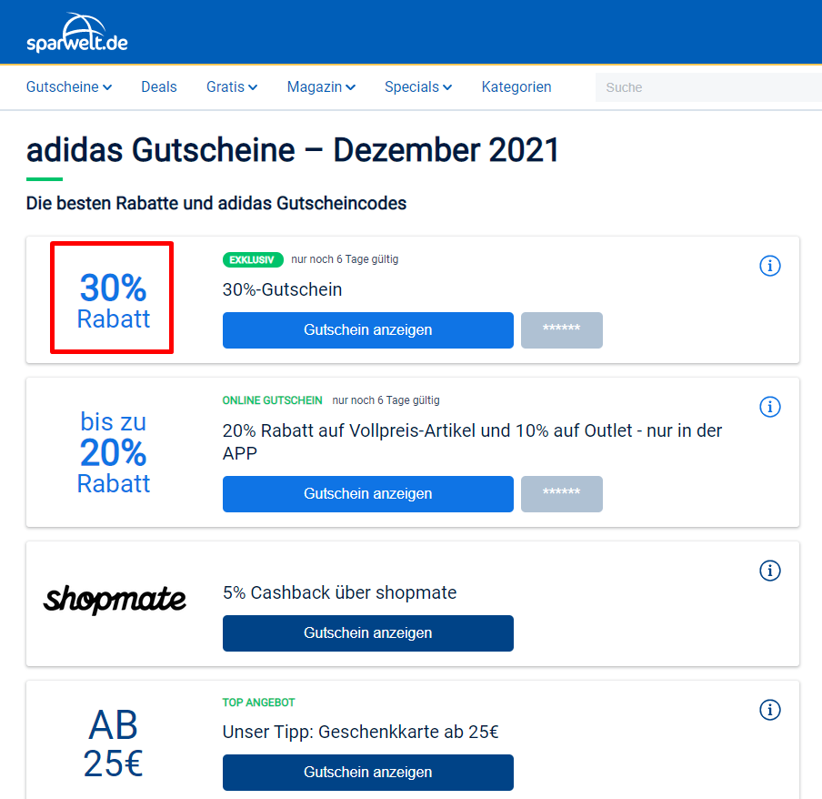

# GoogleAdsAPI-Example
A sample project that uses Google Ads API.

# 1. What is does

Get all unique URLs from eligible Ads (Expanded Text Ads and Responsive Search Ads) and crawl the landing page using `BeautifulSoup` to get the first voucher on page. In this example, we crawl SparWelt.de.

Example: when crawling the page `https://www.sparwelt.de/gutscheine/adidas-shop`, the first voucher `30% Rabatt` is returned.

# 2. Introduction to Google Ads API

The Google Ads API is the modern programmatic interface to Google Ads and the next generation of the AdWords API. It enables developers to interact directly with the Google Ads platform, vastly increasing the efficiency of managing large or complex Google Ads accounts and campaigns. 

Read more: https://developers.google.com/google-ads/api/docs/start

# 3. Requirements

- Python 3.7+
- [google-ads](https://github.com/googleads/google-ads-python)
- [Developer Token for Google Ads API](https://developers.google.com/google-ads/api/docs/first-call/overview)
- Client configuration (`google-ads.yaml`). [Read more](https://developers.google.com/google-ads/api/docs/client-libs/python/configuration?hl=en)
- [BeautifulSoup](https://pypi.org/project/beautifulsoup4/)